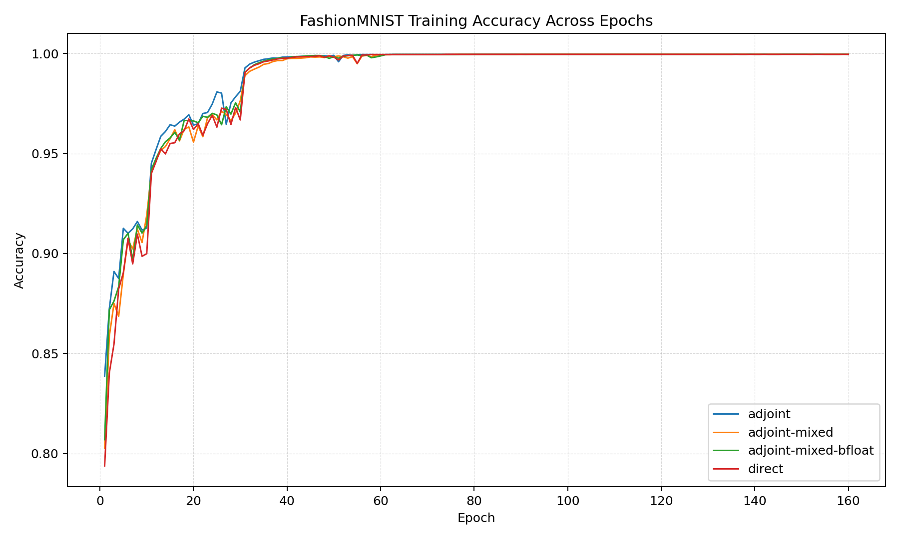
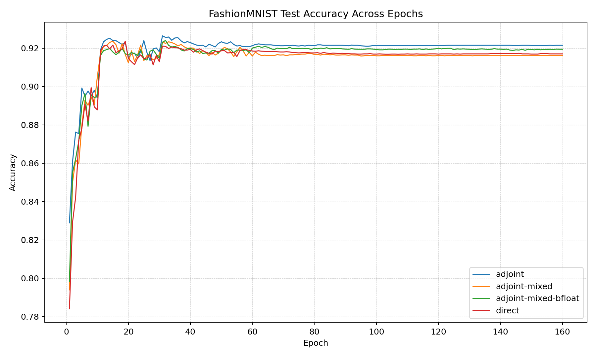

# Fashion MNIST Final Metrics Summary

## Full Training Metrics 

```text
mode                 | final_val_err  | best_val_err | train_mem_mb | train_time_s | infer_time_s | infer_mem_mb |
---------------------+----------------+--------------+--------------+--------------+--------------+--------------+
adjoint              | 0.0785         | 0.0736       | 171.27       | 1658.22      | 0.6300       | 1831.83      |
adjoint-mixed        | 0.0838         | 0.0764       | 164.32       | 3095.77      | 0.7000       | 1698.25      |
adjoint-mixed-bfloat | 0.0806         | 0.076        | 163.20       | 1856.93      | 0.6700       | 1698.25      |
direct               | 0.083          | 0.0764       | 221.06       | 1231.05      | 0.6500       | 352.59       |
```

Log files:
- adjoint: adj_full_logs.txt
- adjoint-mixed: adj_fl16_full_logs.txt
- adjoint-mixed-bfloat: adj_bfl16_full_logs.txt
- direct: dir_full_logs.txt


Experiment Parameters:
- Network Architecture:
    - Same as torchfde/Neural FDE paper (same as MNIST example)

- FDE_Block:
    - Beta: 0.3
    - T: 1.0
    - step_size: 0.1
    - $f$ in $D^\beta z = f$: Convolution Module

- Training Arguments:
    - Epochs: 160 
    - Batch Size: 128
    - Initial LR: 0.1, decay at specified boundary epochs 
    - Momentum: 0.9
    - GPU: NVIDIA H200 (Palmetto)

Note: 
- adjoint mode uses adjoint method for gradients but in high precision
- adjoint-mixed mode uses adjoint method with float16 for mixed precision (and hence the DynamicScaler)
- adjoint-mixed-bflat uses adjoint method with bfloat16 for mixed precision (and hence no DynamicScaler)
- direct mode uses standard backprop with high precision
    
Training Plot (every epoch):


Test Accuracy Plot (every epoch):



## Fashion MNIST Final Time, T, Sweep Comparisions

We use the same network architecture and fractional dynamics as above, but now we sweep the final time $T$ across a range of values. Specifically, we take 

$$T \in \left\{1, 2, 4, 8, 16, 32, 64, 128\right\}$$

and report peak GPU memory for each epoch and time per epoch for training. 

