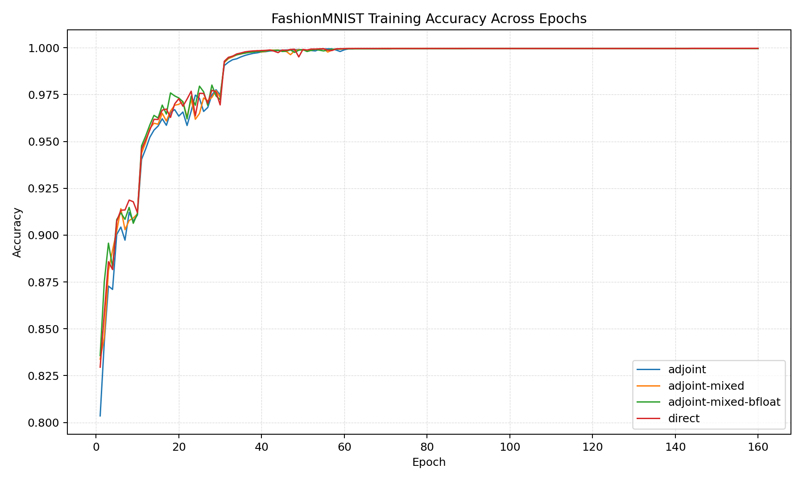
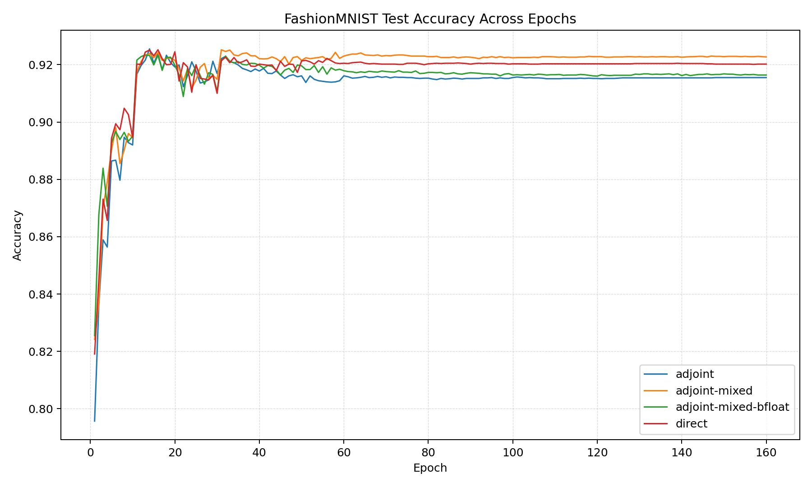

# Fashion MNIST Final Metrics Summary

## Full Training Metrics 

```text
mode                 | final_train_acc | final_val_err | best_val_err | train_mem_mb | train_time_s | infer_time_s | infer_mem_mb
---------------------+-----------------+---------------+--------------+--------------+--------------+--------------+-------------
adjoint              | 0.9999          | 0.0813        | 0.0773       | 171.27       | 1559.38      | 0.6400       | 1831.83     
adjoint-mixed        | 0.9996          | 0.0773        | 0.0748       | 159.95       | 1866.96      | 0.6600       | 227.92      
adjoint-mixed-bfloat | 0.9996          | 0.0836        | 0.0766       | 159.95       | 1877.39      | 0.6500       | 227.92      
direct               | 0.9996          | 0.0778        | 0.071        | 221.06       | 1204.35      | 0.6400       | 352.59      
```

Memory savings: $27.6\\%$ between direct back propagation and adjoint MP (adjoint MP has lower memory). 
See below for details on how memory savings change as T increases (and hence model depth increases). 

Log files:
- adjoint: adj_full_logs.txt
- adjoint-mixed: adj_fl16_full_logs.txt
- adjoint-mixed-bfloat: adj_bfl16_full_logs.txt
- direct: dir_full_logs.txt


Experiment Parameters:
- Network Architecture:
    - Same as torchfde/Neural FDE paper (same as MNIST example)

- FDE_Block:
    - Beta: 0.3
    - T: 1.0
    - step_size: 0.1
    - $f$ in $D^\beta z = f$: Convolution Module

- Training Arguments:
    - Epochs: 160 
    - Batch Size: 128
    - Initial LR: 0.1, decay at specified boundary epochs 
    - Momentum: 0.9
    - Weight decay: 5e-4
    - GPU: NVIDIA H200 (Palmetto)

Note: 
- adjoint mode uses adjoint method for gradients but in high precision
- adjoint-mixed mode uses adjoint method with float16 for mixed precision (and hence the DynamicScaler)
- adjoint-mixed-bflat uses adjoint method with bfloat16 for mixed precision (and hence no DynamicScaler)
- direct mode uses standard backprop with high precision
    
Training Plot (every epoch):


Test Accuracy Plot (every epoch):



## Fashion MNIST Final Time, T, Sweep Comparisions

We use the same network architecture and fractional dynamics as above, but now we sweep the final time $T$ across a range of values. Specifically, we take 
```math
T \in \{1, 2, 4, 8, 16, 32, 64, 128\}
```
and report peak GPU memory for each epoch and time per epoch for training. 

# Memory Results (Peak Memory, MB)
```text
|---------------|--------|--------|--------|--------|---------|---------|---------|----------|
|   method \ T  |   1    |   2    |   4    |   8    |   16    |   32    |   64    |   128    |
|---------------|--------|--------|--------|--------|---------|---------|---------|----------|
|      dir      | 221.06 | 312.35 | 494.94 | 860.12 | 1590.48 | 3051.29 | 5973.20 | 11818.20 |
|      adj      | 171.27 | 197.37 | 264.87 | 399.87 | 669.87  | 1209.87 | 2289.87 | 4449.87  |
|   adj_fl16    | 159.95 | 171.20 | 193.70 | 238.70 | 328.70  | 508.70  | 868.71  | 1588.71  |
|   adj_bfl16   | 159.95 | 171.20 | 193.70 | 238.70 | 328.70  | 508.70  | 868.71  | 1588.71  |
|---------------|--------|--------|--------|--------|---------|---------|---------|----------|
| dir/adj       | 1.291  | 1.583  | 1.869  | 2.151  | 2.374   | 2.522   | 2.609   | 2.656    |
| dir/adj_fl16  | 1.382  | 1.824  | 2.555  | 3.603  | 4.839   | 5.998   | 6.876   | 7.439    |
| dir/adj_bfl16 | 1.382  | 1.824  | 2.555  | 3.603  | 4.839   | 5.998   | 6.876   | 7.439    |
| adj/adj_fl16  | 1.071  | 1.153  | 1.367  | 1.675  | 2.038   | 2.378   | 2.636   | 2.801    |
| adj/adj_bfl16 | 1.071  | 1.153  | 1.367  | 1.675  | 2.038   | 2.378   | 2.636   | 2.801    |
|---------------|--------|--------|--------|--------|---------|---------|---------|----------|
```


# Time Results (s)
```text
|---------------|--------|--------|--------|--------|---------|---------|---------|----------|
|   method \ T  |   1    |   2    |   4    |   8    |   16    |   32    |   64    |   128    |
|---------------|--------|--------|--------|--------|---------|---------|---------|----------|
|      dir      | 4.81   | 8.87   | 19.97  | 55.16  | 167.18  | 753.91  | 3076.32 | 12672.00 |
|      adj      | 7.39   | 11.36  | 21.99  | 40.73  | 79.69   | 173.52  | 448.15  | 1328.24  |
|   adj_fl16    | 9.27   | 15.38  | 30.59  | 66.02  | 132.00  | 410.39  | 1242.39 | 4159.84  |
|   adj_bfl16   | 8.31   | 14.44  | 28.02  | 60.79  | 145.34  | 391.92  | 1196.98 | 6663.28  |
|---------------|--------|--------|--------|--------|---------|---------|---------|----------|
| dir/adj       | 0.651  | 0.781  | 0.908  | 1.354  | 2.098   | 4.345   | 6.864   | 9.540    |
| dir/adj_fl16  | 0.519  | 0.576  | 0.653  | 0.835  | 1.266   | 1.837   | 2.476   | 3.046    |
| dir/adj_bfl16 | 0.579  | 0.614  | 0.713  | 0.907  | 1.150   | 1.924   | 2.570   | 1.902    |
| adj/adj_fl16  | 0.797  | 0.739  | 0.719  | 0.617  | 0.604   | 0.423   | 0.361   | 0.319    |
| adj/adj_bfl16 | 0.889  | 0.787  | 0.785  | 0.670  | 0.548   | 0.443   | 0.374   | 0.199    |
|---------------|--------|--------|--------|--------|---------|---------|---------|----------|
```
