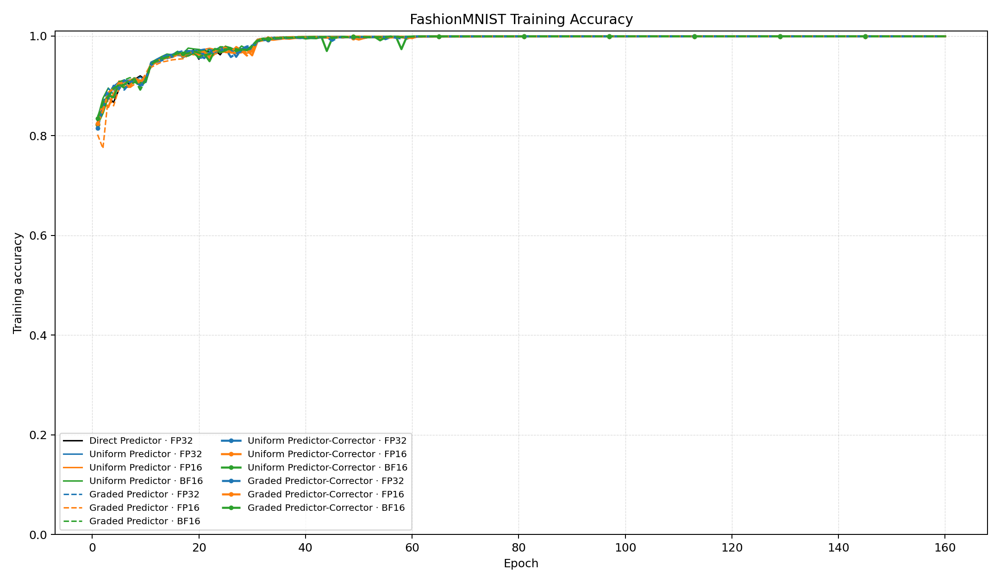
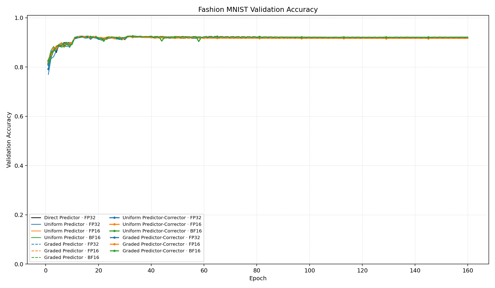

# Fashion MNIST Final Metrics Summary

## Full Training Metrics

```text
configuration                      | backward mode        | mesh    | precision | status | final_acc | best_acc | train_mem_mb | train_time_s | inf_time_s | inf_mem_mb
-----------------------------------+----------------------+---------+-----------+--------+-----------+----------+--------------+--------------+------------+-----------
Direct Predictor · FP32            | direct AG            | uniform | float32   | ok     | 0.9218    | 0.9259   | 221.06       | 1063.47      | 0.52       | 120.24    
Uniform Predictor · FP32           | adjoint              | uniform | float32   | ok     | 0.9176    | 0.9226   | 166.48       | 1300.98      | 0.59       | 120.24    
Uniform Predictor · FP16           | adjoint-mixed        | uniform | float16   | ok     | 0.9211    | 0.9262   | 162.22       | 3564.86      | 0.78       | 120.48    
Uniform Predictor · BF16           | adjoint-mixed-bfloat | uniform | bfloat16  | ok     | 0.9164    | 0.9234   | 159.95       | 2569.69      | 0.80       | 120.48    
Graded Predictor · FP32            | adjoint              | graded  | float32   | ok     | 0.9209    | 0.9254   | 166.48       | 1976.20      | 0.74       | 120.24    
Graded Predictor · FP16            | adjoint-mixed        | graded  | float16   | ok     | 0.9160    | 0.9260   | 162.22       | 3674.37      | 0.88       | 120.48    
Graded Predictor · BF16            | adjoint-mixed-bfloat | graded  | bfloat16  | ok     | 0.9202    | 0.9229   | 159.95       | 1623.00      | 0.75       | 120.48    
Uniform Predictor-Corrector · FP32 | adjoint              | uniform | float32   | ok     | 0.9184    | 0.9237   | 180.27       | 2489.25      | 0.81       | 120.24    
Uniform Predictor-Corrector · FP16 | adjoint-mixed        | uniform | float16   | ok     | 0.9167    | 0.9249   | 168.97       | 4176.99      | 0.89       | 120.48    
Uniform Predictor-Corrector · BF16 | adjoint-mixed-bfloat | uniform | bfloat16  | ok     | 0.9193    | 0.9256   | 167.56       | 4762.59      | 1.42       | 120.48    
Graded Predictor-Corrector · FP32  | adjoint              | graded  | float32   | ok     | 0.9199    | 0.9253   | 180.27       | 3819.45      | 1.21       | 120.24    
Graded Predictor-Corrector · FP16  | adjoint-mixed        | graded  | float16   | ok     | 0.9178    | 0.9256   | 168.97       | 7305.76      | 1.50       | 120.48    
Graded Predictor-Corrector · BF16  | adjoint-mixed-bfloat | graded  | bfloat16  | ok     | 0.9217    | 0.9261   | 167.56       | 3048.05      | 0.96       | 120.48    
```

Predictor:
- Adjoint MP memory savings compared to direct AG: $27.6\\%$.
    - Note: this scales with $T/h$, see below for memory savings of up to $86.6\\%$.
- Adjoint MP memory savings compared to full precision adjoint: $3.9\\%$
    - Note: this scales with $T/h$, see below for memory savings of up to $47.5\\%$.

Predictor-Corrector:
- Adjoint MP memory savings compared to full precision adjoint: $7.1\\%$

Experiment Parameters:
- Network Architecture:
    - Same as the torchfde Neural FDE paper (and the MNIST example)
    - Model parameter count: 208266
- FDE_Block:
    - Beta: 0.3
    - T: 1.0
    - step_size: 0.1
    - $f$ in $D^\beta z = f$: Convolution module
- Training Arguments:
    - Epochs: 160
    - Batch size: 128
    - Initial LR: 0.1, decayed at the specified boundary epochs
    - Momentum: 0.9
    - Weight decay: 5e-4
    - GPU: NVIDIA H200 (Palmetto)

Parameter count: 208266

Note:
- adjoint mode uses the custom adjoint in float32 throughout
- adjoint-mixed mode uses float16 adjoint storage and the DynamicScaler
- adjoint-mixed-bfloat uses bfloat16 adjoint storage without dynamic scaling
- direct mode uses standard backpropagation in float32
- graded and uniform specify the shared forward/backward time mesh

Training Plot (every logged epoch):


Validation Accuracy Plot (every logged epoch):



## Fashion MNIST Final Time, T, Sweep Comparisions

We use the same network architecture and fractional dynamics as above, but now we sweep the final time $T$ across a range of values. Specifically, we take 
```math
T \in \{1, 2, 4, 8, 16, 32, 64, 128\}
```
and report peak GPU memory for each epoch and time per epoch for training. 

# Memory Results (Peak Memory, MB)

- Solver configuration: Uniform Predictor
- Loss scaling: direct=false, adjoint=false, adjoint-mixed=dynamic, adjoint-mixed-bfloat=false

```text
|---------------|--------|--------|--------|--------|---------|---------|---------|----------|
|   method \ T  |   1    |   2    |   4    |   8    |   16    |   32    |   64    |   128    |
|---------------|--------|--------|--------|--------|---------|---------|---------|----------|
|      dir      | 221.06 | 312.35 | 494.94 | 860.12 | 1590.48 | 3051.29 | 5973.20 | 11818.20 |
|      adj      | 166.48 | 188.98 | 233.98 | 323.98 | 503.98  | 863.98  | 1583.98 | 3023.99  |
|   adj_fl16    | 162.22 | 173.47 | 195.97 | 240.97 | 330.97  | 510.97  | 870.98  | 1590.98  |
|   adj_bfl16   | 159.95 | 171.20 | 193.70 | 238.70 | 328.70  | 508.71  | 868.71  | 1588.72  |
|---------------|--------|--------|--------|--------|---------|---------|---------|----------|
| dir/adj       | 1.328  | 1.653  | 2.115  | 2.655  | 3.156   | 3.532   | 3.771   | 3.908    |
| dir/adj_fl16  | 1.363  | 1.801  | 2.526  | 3.569  | 4.806   | 5.972   | 6.858   | 7.428    |
| dir/adj_bfl16 | 1.382  | 1.824  | 2.555  | 3.603  | 4.839   | 5.998   | 6.876   | 7.439    |
| adj/adj_fl16  | 1.026  | 1.089  | 1.194  | 1.344  | 1.523   | 1.691   | 1.819   | 1.901    |
| adj/adj_bfl16 | 1.041  | 1.104  | 1.208  | 1.357  | 1.533   | 1.698   | 1.823   | 1.903    |
|---------------|--------|--------|--------|--------|---------|---------|---------|----------|
```


# Time Results (s)

- Solver configuration: Uniform Predictor
- Loss scaling: direct=false, adjoint=false, adjoint-mixed=dynamic, adjoint-mixed-bfloat=false

```text
|---------------|--------|--------|--------|--------|---------|---------|---------|----------|
|   method \ T  |   1    |   2    |   4    |   8    |   16    |   32    |   64    |   128    |
|---------------|--------|--------|--------|--------|---------|---------|---------|----------|
|      dir      | 4.45   | 8.38   | 18.84  | 52.50  | 163.19  | 623.63  | 2596.07 | 15021.00 |
|      adj      | 5.53   | 10.10  | 20.34  | 44.49  | 112.58  | 552.15  | 1736.59 | 3332.12  |
|   adj_fl16    | 12.27  | 23.31  | 45.89  | 99.58  | 232.61  | 592.99  | 1734.67 | 5111.00  |
|   adj_bfl16   | 6.29   | 11.52  | 22.62  | 49.48  | 119.74  | 328.53  | 1005.61 | 6025.29  |
|---------------|--------|--------|--------|--------|---------|---------|---------|----------|
| dir/adj       | 0.805  | 0.829  | 0.926  | 1.180  | 1.449   | 1.129   | 1.495   | 4.508    |
| dir/adj_fl16  | 0.363  | 0.359  | 0.411  | 0.527  | 0.702   | 1.052   | 1.497   | 2.939    |
| dir/adj_bfl16 | 0.707  | 0.727  | 0.833  | 1.061  | 1.363   | 1.898   | 2.582   | 2.493    |
| adj/adj_fl16  | 0.451  | 0.433  | 0.443  | 0.447  | 0.484   | 0.931   | 1.001   | 0.652    |
| adj/adj_bfl16 | 0.879  | 0.877  | 0.899  | 0.899  | 0.940   | 1.681   | 1.727   | 0.553    |
|---------------|--------|--------|--------|--------|---------|---------|---------|----------|
```
