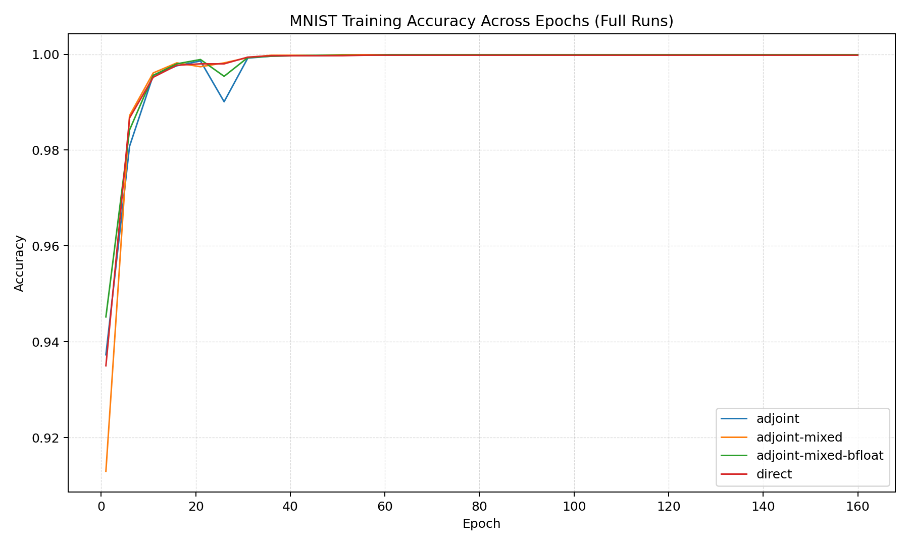
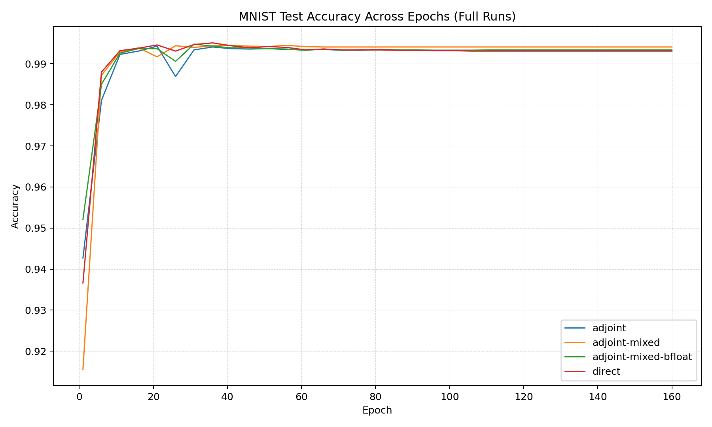

# Fashion MNIST Final Metrics Summary

## Full Training Metrics 

```text
mode                 | final_val_err | best_val_err | train_mem_mb | train_time_s | infer_time_s | infer_mem_mb
---------------------+---------------+--------------+--------------+--------------+--------------+-------------
adjoint              | 0.0068        | 0.0056       | 804.87       | 23349.84     | 5.3700       | 7816.83     
adjoint-mixed        | 0.0059        | 0.0054       | 590.98       | 54908.84     | 6.1100       | 4370.12     
adjoint-mixed-bfloat | 0.0066        | 0.0052       | 590.70       | 27176.37     | 6.1800       | 4370.12     
direct               | 0.0069        | 0.0049       | 1955.68      | 72185.53     | 26.6000      | 3608.08     
```

Log files:
- adjoint: adj_full_logs.txt
- adjoint-mixed: adj_fl16_full_logs.txt
- adjoint-mixed-bfloat: adj_bfl16_full_logs.txt
- direct: dir_full_logs.txt


Experiment Parameters:
- Network Architecture:
    - Same as torchfde/Neural FDE paper 

- FDE_Block:
    - Beta: 0.5
    - T: 20.0
    - step_size: 0.1
    - $f$ in $D^\beta z = f$: Convolution Module

- Training Arguments:
    - Epochs: 160 
    - Batch Size: 128
    - Initial LR: 0.1, decay at specified boundary epochs 
    - Momentum: 0.9
    - Weight decay: 5e-4
    - GPU: NVIDIA H200 (Palmetto)

Note: 
- adjoint mode uses adjoint method for gradients but in high precision
- adjoint-mixed mode uses adjoint method with float16 for mixed precision (and hence the DynamicScaler)
- adjoint-mixed-bflat uses adjoint method with bfloat16 for mixed precision (and hence no DynamicScaler)
- direct mode uses standard backprop with high precision
    
Training Plot (every epoch):


Test Accuracy Plot (every epoch):



