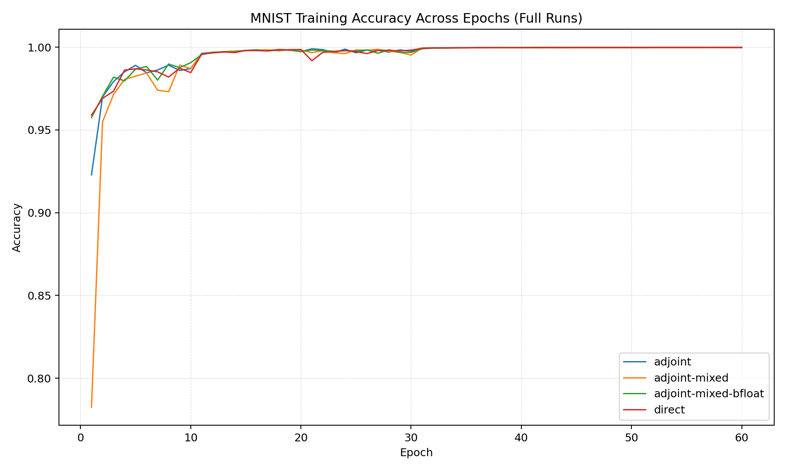
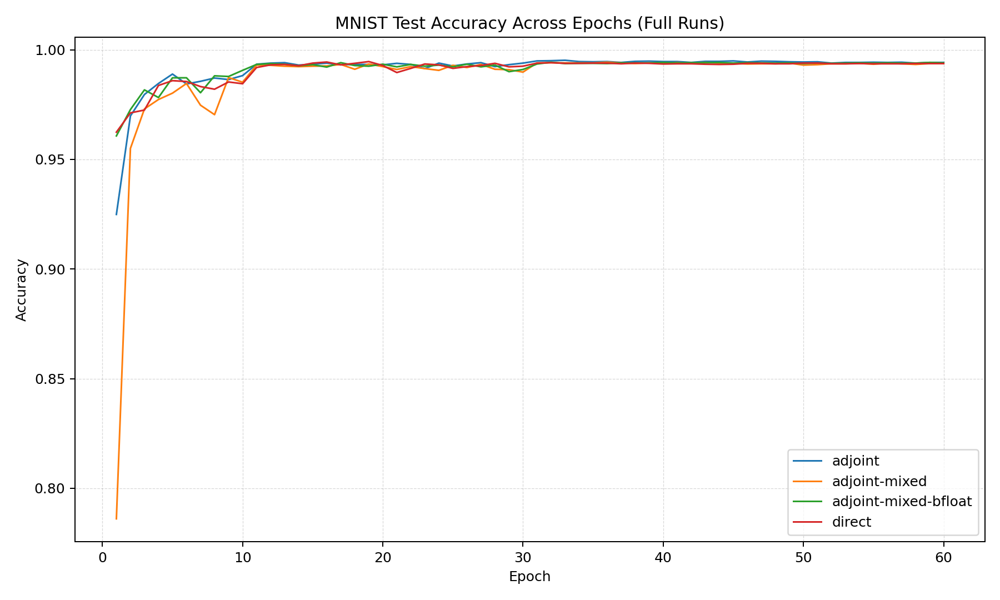

# MNIST Final Metrics Summary

## Full Training Metrics 

```text
mode                 | final_train_acc | final_val_err | best_val_err | train_mem_mb | train_time_s | infer_time_s | infer_mem_mb
---------------------+-----------------+---------------+--------------+--------------+--------------+--------------+-------------
adjoint              | 0.9999          | 0.0060        | 0.0046       | 804.87       | 23706.09     | 5.3900       | 6694.79     
adjoint-mixed        | 0.9999          | 0.0068        | 0.0057       | 373.70       | 52243.52     | 13.370       | 548.54      
adjoint-mixed-bfloat | 0.9998          | 0.0060        | 0.0057       | 373.70       | 49214.27     | 13.280       | 548.54      
direct               | 0.9998          | 0.0071        | 0.0063       | 1955.68      | 71926.16     | 26.230       | 3608.08     
```

Memory savings: $80.9\\%$ between direct and adjoint MP (adjoint MP uses less)

Log files:
- adjoint: adj_full_logs.txt
- adjoint-mixed: adj_fl16_full_logs.txt
- adjoint-mixed-bfloat: adj_bfl16_full_logs.txt
- direct: dir_full_logs.txt


Experiment Parameters:
- Network Architecture:
    - Same as torchfde/Neural FDE paper 

- FDE_Block:
    - Beta: 0.5
    - T: 20.0
    - step_size: 0.1
    - $f$ in $D^\beta z = f$: Convolution Module

- Training Arguments:
    - Epochs: 160 
    - Batch Size: 128
    - Initial LR: 0.1, decay at specified boundary epochs 
    - Momentum: 0.9
    - Weight decay: 5e-4
    - GPU: NVIDIA H200 (Palmetto)

Note: 
- adjoint mode uses adjoint method for gradients but in high precision
- adjoint-mixed mode uses adjoint method with float16 for mixed precision (and hence the DynamicScaler)
- adjoint-mixed-bflat uses adjoint method with bfloat16 for mixed precision (and hence no DynamicScaler)
- direct mode uses standard backprop with high precision
    
Training Plot (every epoch):


Test Accuracy Plot (every epoch):



