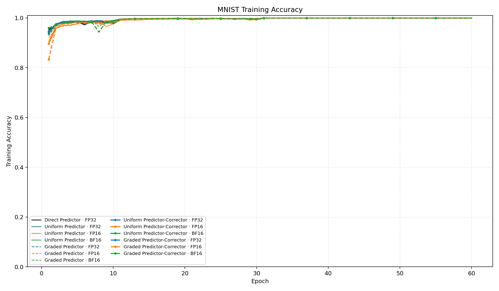
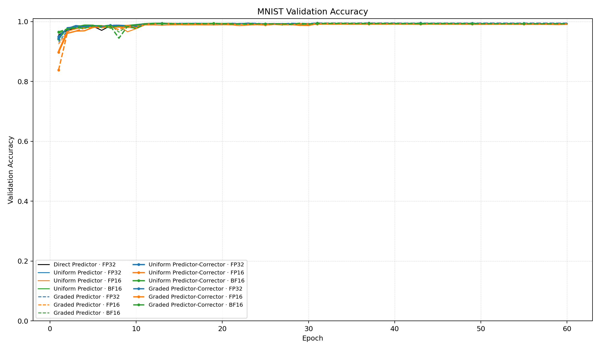

# MNIST Final Metrics Summary

## Full Training Metrics

```text
configuration                      | backward mode        | mesh    | precision | status | final_acc | best_acc | train_mem_mb | train_time_s | inf_time_s | inf_mem_mb
-----------------------------------+----------------------+---------+-----------+--------+-----------+----------+--------------+--------------+------------+-----------
Direct Predictor · FP32            | direct AG            | uniform | float32   | ok     | 0.9936    | 0.9940   | 1955.68      | 36218.77     | 25.17      | 299.19    
Uniform Predictor · FP32           | adjoint              | uniform | float32   | ok     | 0.9935    | 0.9946   | 593.98       | 13010.70     | 9.74       | 527.56    
Uniform Predictor · FP16           | adjoint-mixed        | uniform | float16   | ok     | 0.9905    | 0.9913   | 375.97       | 33806.14     | 15.48      | 300.65    
Uniform Predictor · BF16           | adjoint-mixed-bfloat | uniform | bfloat16  | ok     | 0.9940    | 0.9943   | 373.70       | 27291.46     | 19.62      | 300.65    
Graded Predictor · FP32            | adjoint              | graded  | float32   | ok     | 0.9937    | 0.9942   | 593.98       | 12558.70     | 9.39       | 527.56    
Graded Predictor · FP16            | adjoint-mixed        | graded  | float16   | ok     | 0.9935    | 0.9945   | 375.97       | 22524.55     | 12.23      | 300.65    
Graded Predictor · BF16            | adjoint-mixed-bfloat | graded  | bfloat16  | ok     | 0.9930    | 0.9945   | 373.70       | 21613.68     | 15.56      | 300.65    
Uniform Predictor-Corrector · FP32 | adjoint              | uniform | float32   | ok     | 0.9932    | 0.9943   | 821.52       | 44945.87     | 24.11      | 755.94    
Uniform Predictor-Corrector · FP16 | adjoint-mixed        | uniform | float16   | ok     | 0.9929    | 0.9933   | 489.60       | 126654.82    | 34.26      | 415.96    
Uniform Predictor-Corrector · BF16 | adjoint-mixed-bfloat | uniform | bfloat16  | ok     | 0.9931    | 0.9948   | 488.18       | 86537.65     | 48.71      | 415.96    
Graded Predictor-Corrector · FP32  | adjoint              | graded  | float32   | ok     | 0.9949    | 0.9953   | 821.52       | 79887.57     | 40.04      | 755.94    
Graded Predictor-Corrector · FP16  | adjoint-mixed        | graded  | float16   | ok     | 0.9929    | 0.9937   | 489.60       | 123654.21    | 41.44      | 415.96    
Graded Predictor-Corrector · BF16  | adjoint-mixed-bfloat | graded  | bfloat16  | ok     | 0.9931    | 0.9948   | 488.18       | 83971.62     | 46.95      | 415.96    
```

Predictor:
- Adjoint MP memory savings compared to direct AG: $80.9\\%$
- Adjoint MP memory savings compared to full precision adjoint: $37.1\\%$

Predictor-Corrector:
- Adjoint MP memory savings compared to full precision adjoint: $40.6\\%$

Experiment Parameters:
- Network Architecture:
    - Same as the torchfde Neural FDE paper
    - Model parameter count: 208266
- FDE_Block:
    - Beta: 0.5
    - T: 20.0
    - step_size: 0.1
    - $f$ in $D^\beta z = f$: Convolution module
- Training Arguments:
    - Epochs: 60
    - Batch size: 128
    - Initial LR: 0.1, decayed at the specified boundary epochs
    - Momentum: 0.9
    - Weight decay: 5e-4
    - GPU: NVIDIA H200 (Palmetto)

Parameter count: 208266

Note:
- adjoint mode uses the custom adjoint in float32 throughout
- adjoint-mixed mode uses float16 adjoint storage and the DynamicScaler
- adjoint-mixed-bfloat uses bfloat16 adjoint storage without dynamic scaling
- direct mode uses standard backpropagation in float32
- graded and uniform specify the shared forward/backward time mesh

Training Plot (every logged epoch):


Validation Accuracy Plot (every logged epoch):

