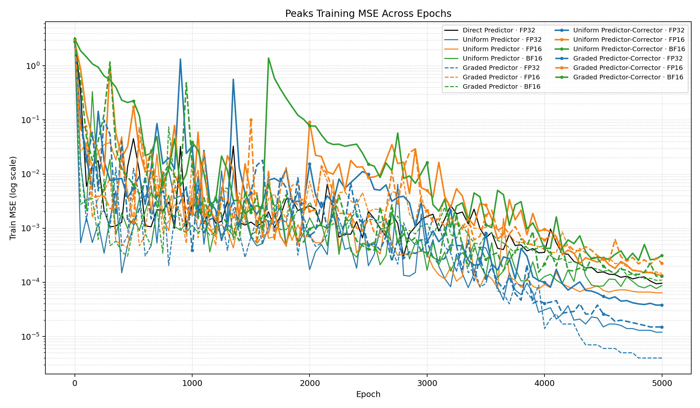
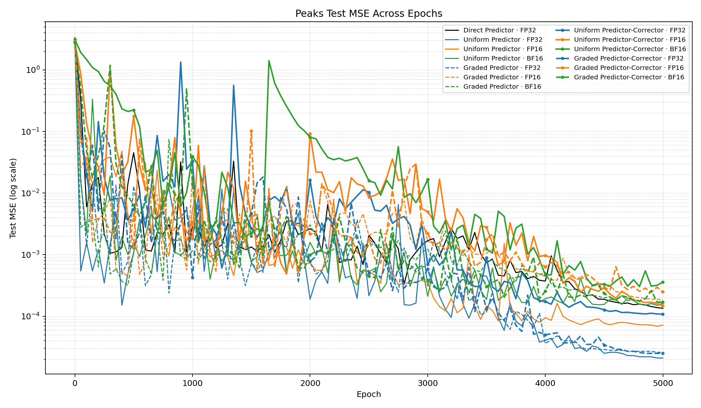

# Peaks Final Metrics Summary

```text
mode                 | final_mse | best_mse | train_mem_mb | train_time_s | infer_time_s | infer_mem_mb
---------------------+-----------+----------+--------------+--------------+--------------+-------------
adjoint              | 2.1e-05   | 2.1e-05  | 542.15       | 5834.02      | 0.0093       | 47.43       
adjoint-mixed        | 7.2e-05   | 7.1e-05  | 293.40       | 4311.43      | 0.0940       | 36.32       
adjoint-mixed-bfloat | 0.000161  | 0.000144 | 293.40       | 2947.32      | 0.0618       | 36.32       
direct               | 0.000135  | 0.000132 | 1038.70      | 5576.26      | 0.0137       | 36.20       
```

Memory savings: $71.8\%$ between direct and adjoint MP (adjoint MP uses less)

Log files:
- adjoint: adj_full_training.log
- adjoint-mixed: adj_fl16_training.log
- adjoint-mixed-bfloat: adj_bfl16_training.log
- direct: dir_training.log

Experiment Parameters:
- Network Architecture:
    - Width: 256
    - Input layer -> tanh() -> FDE_Block -> Output layer 
    - Model parameter count: 198,401
- FDE_Block:
    - Beta: 0.5
    - T: 2.0
    - step_size: 0.1
    - $f$ in $D^\beta z = f$: 3 layer MLP
- Training Arguments:
    - Epochs: 5000
    - Batch size: 10,000
    - Total samples: 200,000
    - Initial LR: 0.01
    - Weight decay: 5e-4
    - GPU: NVIDIA H200 (Palmetto)

Parameter count: 198,401

Note: 
- adjoint mode uses adjoint method for gradients but in high precision
- adjoint-mixed mode uses adjoint method with float16 for mixed precision (and hence the DynamicScaler)
- adjoint-mixed-bflat uses adjoint method with bfloat16 for mixed precision (and hence no DynamicScaler)
- direct mode uses standard backprop with high precision
    
Training Plot (every 50 epochs):


Testing Plot (every 50 epochs):



