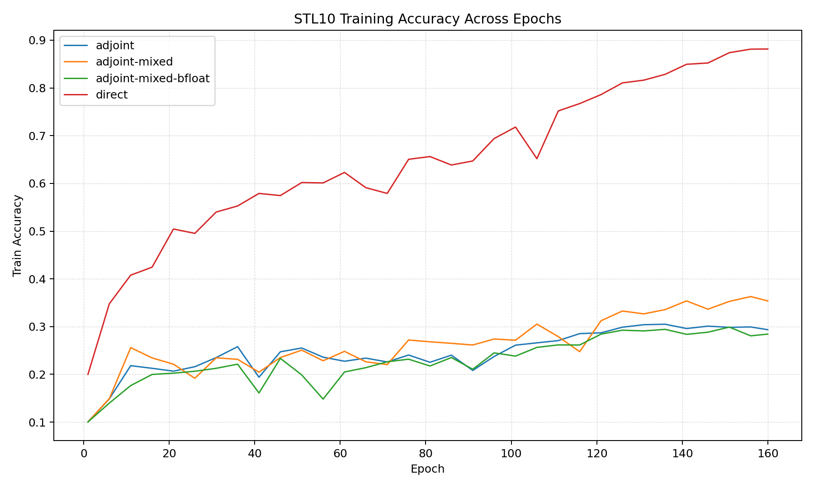

# STL10 Final Metrics Summary

```text
mode                 | Final Val Err | Best Val Err | Train Mem MB | Train Time s | Infer Time s | Infer Mem (?) 
---------------------+---------------+--------------+--------------+--------------+--------------+--------------
adjoint              | 0.719         | 0.697        | 2728.13      | 4387.60      | 1.6600       | 2594178560.00
adjoint-mixed        | 0.68          | 0.645        | 1870.70      | 6591.92      | 2.0000       | 1788963840.00
adjoint-mixed-bfloat | 0.736         | 0.702        | 1833.63      | 4908.39      | 2.0300       | 1788963840.00
direct               | 0.282         | 0.279        | 4299.64      | 3751.55      | 1.6100       | 1185039360.00
```

Log files:
- adjoint: adj_full_training.log
- adjoint-mixed: adj_fl16_training.log
- adjoint-mixed-bfloat: adj_bfl16_training.log
- direct: dir_training.log

Experiment Parameters:
- Network Architecture:
    - Same as Lars but with FDE blocks instead of ODE blocks

- FDE_Block:
    - Beta: 0.6
    - T: 1.0
    - step_size: 0.1
    - $f$ in $D^\beta z = f$: Time-dependent dynamics with piecewise-constant weights (same as Lars')

- Training Arguments:
    - Downsampling and other things exactly same as Lars
    - Epochs: 160 just for preliminary smoke tests
    - Batch Size: 16
    - Initial LR: 0.1
    - Momentum: 0.9
    - GPU: NVIDIA A100 (Palmetto)

Note: 
- adjoint mode uses adjoint method for gradients but in high precision
- adjoint-mixed mode uses adjoint method with float16 for mixed precision (and hence the DynamicScaler)
- adjoint-mixed-bflat uses adjoint method with bfloat16 for mixed precision (and hence no DynamicScaler)
- direct mode uses standard backprop with high precision
    
Training Plot (every 5 epochs):



