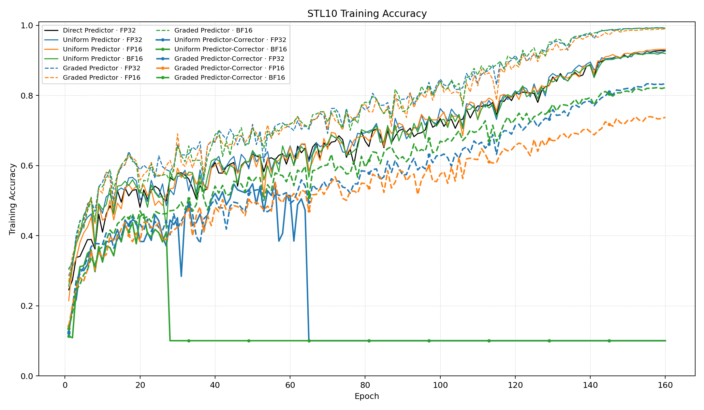
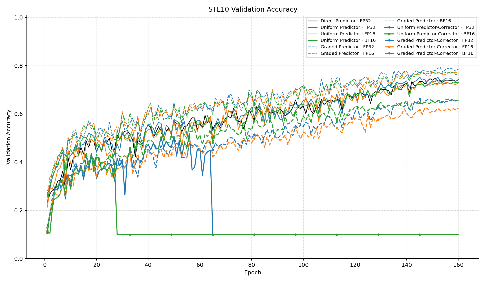

# STL10 Final Metrics Summary

```text
mode                 | final_train_acc | final_val_err | best_val_err | train_mem_mb | train_time_s | infer_time_s | infer_mem_mb
---------------------+-----------------+---------------+--------------+--------------+--------------+--------------+-------------
adjoint              | 0.8672          | 0.295         | 0.288        | 2296.38      | 4553.96      | 1.5000       | 1962.14     
adjoint-mixed        | 0.8695          | 0.311         | 0.304        | 1209.97      | 3330.27      | 1.1100       | 1034.23     
adjoint-mixed-bfloat | 0.8818          | 0.299         | 0.291        | 1207.71      | 3122.13      | 1.4700       | 1034.23     
direct               | 0.8572          | 0.311         | 0.311        | 4299.64      | 4047.21      | 1.7200       | 1130.14     
```

Memory savings: $71.9\\%$ between direct and adjoint MP (adjoint MP uses less)


Log files:
- adjoint: adj_full_training.log
- adjoint-mixed: adj_fl16_training.log
- adjoint-mixed-bfloat: adj_bfl16_training.log
- direct: dir_training.log

Experiment Parameters:
- Network Architecture:
    - Same as Lars but with FDE blocks instead of ODE blocks

- FDE_Block:
    - Beta: 0.6
    - T: 1.0
    - step_size: 0.1
    - $f$ in $D^\beta z = f$: Time-dependent dynamics with piecewise-constant weights (same as Lars')

- Training Arguments:
    - Downsampling and other things exactly same as Lars
    - Epochs: 160 
    - Batch Size: 16
    - Initial LR: 0.1
    - Momentum: 0.9
    - GPU: NVIDIA H200 (Palmetto)

Parameter count: 3,144,970

Note: 
- adjoint mode uses adjoint method for gradients but in high precision
- adjoint-mixed mode uses adjoint method with float16 for mixed precision (and hence the DynamicScaler)
- adjoint-mixed-bflat uses adjoint method with bfloat16 for mixed precision (and hence no DynamicScaler)
- direct mode uses standard backprop with high precision
    
Training Plot (every 5 epochs):


Testing Plot (every 5 epochs):

