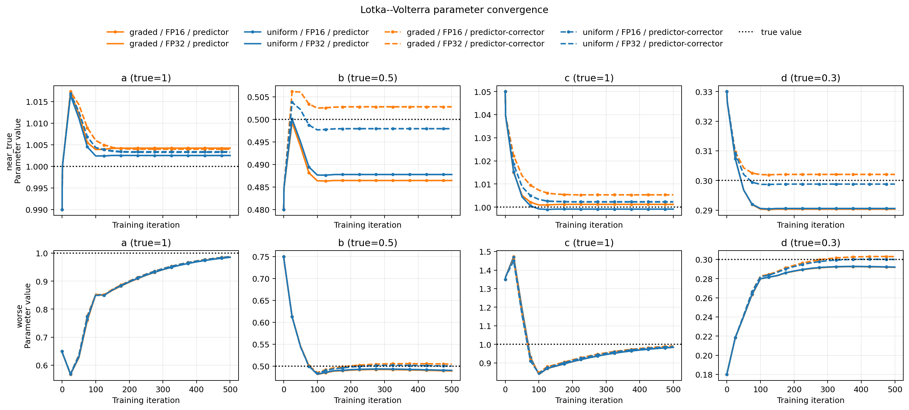
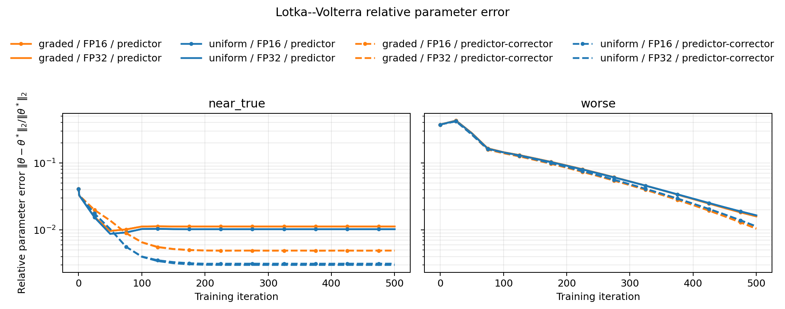

# Lotka--Volterra Final Metrics Summary

## Full Training Metrics

```text
configuration                                    | backward mode | fin_train | fin_val  | best_val | best_iter | param_err | peak_mem_mb | mean_iter_s | est_train_s
-------------------------------------------------+---------------+-----------+----------+----------+-----------+-----------+-------------+-------------+------------
near_true · predictor · uniform · FP32           | adjoint       | 2.37e-3   | 3.20e-3  | 3.17e-3  | 50        | 6.26e-3   | 0.05888     | 0.0669767   | 33.4884
near_true · predictor · uniform · FP16           | adjoint-mixed | 2.37e-3   | 3.20e-3  | 3.17e-3  | 50        | 6.26e-3   | 0.038912    | 0.0822018   | 41.1009
near_true · predictor · graded · FP32            | adjoint       | 2.41e-3   | 3.24e-3  | 3.22e-3  | 75        | 7.16e-3   | 0.058368    | 0.0541925   | 27.0963
near_true · predictor · graded · FP16            | adjoint-mixed | 2.41e-3   | 3.24e-3  | 3.22e-3  | 75        | 7.16e-3   | 0.0384      | 0.0808647   | 40.4323
near_true · predictor-corrector · uniform · FP32 | adjoint       | 2.46e-3   | 3.33e-3  | 3.33e-3  | 275       | 2.17e-3   | 0.081408    | 0.177432    | 88.7159
near_true · predictor-corrector · uniform · FP16 | adjoint-mixed | 2.45e-3   | 3.33e-3  | 3.33e-3  | 500       | 2.27e-3   | 0.051712    | 0.242598    | 121.299
near_true · predictor-corrector · graded · FP32  | adjoint       | 2.48e-3   | 3.44e-3  | 3.44e-3  | 275       | 3.55e-3   | 0.081408    | 0.176951    | 88.4756
near_true · predictor-corrector · graded · FP16  | adjoint-mixed | 2.48e-3   | 3.44e-3  | 3.44e-3  | 375       | 3.53e-3   | 0.051712    | 0.244847    | 122.423
-------------------------------------------------+---------------+-----------+----------+------------+-----------+------------+-------------+-------------+------------
worse · predictor · uniform · FP32               | adjoint       | 2.39e-3   | 3.21e-3  | 3.21e-3  | 500       | 1.21e-2   | 0.05888     | 0.054542    | 27.271 
worse · predictor · uniform · FP16               | adjoint-mixed | 2.39e-3   | 3.21e-3  | 3.21e-3  | 500       | 1.21e-2   | 0.038912    | 0.0814781   | 40.7391
worse · predictor · graded · FP32                | adjoint       | 2.43e-3   | 3.24e-3  | 3.24e-3  | 500       | 1.19e-2   | 0.058368    | 0.0538821   | 26.941 
worse · predictor · graded · FP16                | adjoint-mixed | 2.43e-3   | 3.24e-3  | 3.24e-3  | 500       | 1.19e-2   | 0.0384      | 0.0812588   | 40.6294
worse · predictor-corrector · uniform · FP32     | adjoint       | 2.47e-3   | 3.28e-3  | 3.27e-3  | 450       | 6.19e-3   | 0.081408    | 0.177851    | 88.9257
worse · predictor-corrector · uniform · FP16     | adjoint-mixed | 2.47e-3   | 3.28e-3  | 3.27e-3  | 450       | 6.17e-3   | 0.051712    | 0.243615    | 121.808
worse · predictor-corrector · graded · FP32      | adjoint       | 2.50e-3   | 3.36e-3  | 3.35e-3  | 425       | 7.25e-3   | 0.081408    | 0.176737    | 88.3684
worse · predictor-corrector · graded · FP16      | adjoint-mixed | 2.50e-3   | 3.36e-3  | 3.35e-3  | 425       | 7.14e-3   | 0.051712    | 0.241991    | 120.996
```

FP16 memory savings compared with FP32:
- near_true, predictor, uniform: $33.9\\%$
- near_true, predictor, graded: $34.2\\%$
- near_true, predictor-corrector, uniform: $36.5\\%$
- near_true, predictor-corrector, graded: $36.5\\%$
- worse, predictor, uniform: $33.9\\%$
- worse, predictor, graded: $34.2\\%$
- worse, predictor-corrector, uniform: $36.5\\%$
- worse, predictor-corrector, graded: $36.5\\%$

Experiment Parameters:
- Fractional Lotka--Volterra system:
    - $D^\beta x = x(a-cy)$
    - $D^\beta y = -y(b-dx)$
    - True parameters $[a,b,c,d]$: [1.0, 0.5, 1.0, 0.3]
    - Beta: 0.7
    - T: 5.0
    - Training step size: 0.1
    - Synthetic-data step size: 0.02
- Training Arguments:
    - Iterations: 500
    - Training trajectories: 50
    - Validation trajectories: 25
    - Noise standard deviation: 0.05
    - Learning rate: 0.01
    - Seed: 42

```text
Initialization and Final Learned Parameters:
- near_true · predictor · uniform · FP32:             initial [0.99, 0.48, 1.05, 0.33]     final [1.002521, 0.487760, 0.999159, 0.290551]
- near_true · predictor · uniform · FP16:             initial [0.99, 0.48, 1.05, 0.33]     final [1.002488, 0.487767, 0.999131, 0.290555]
- near_true · predictor · graded · FP32:              initial [0.99, 0.48, 1.05, 0.33]     final [1.004222, 0.486438, 1.001205, 0.290336]
- near_true · predictor · graded · FP16:              initial [0.99, 0.48, 1.05, 0.33]     final [1.004216, 0.486443, 1.001200, 0.290339]
- near_true · predictor-corrector · uniform · FP32:   initial [0.99, 0.48, 1.05, 0.33]     final [1.003238, 0.497961, 1.002203, 0.298782]
- near_true · predictor-corrector · uniform · FP16:   initial [0.99, 0.48, 1.05, 0.33]     final [1.003404, 0.497927, 1.002359, 0.298756]
- near_true · predictor-corrector · graded · FP32:    initial [0.99, 0.48, 1.05, 0.33]     final [1.003972, 0.502827, 1.005322, 0.302073]
- near_true · predictor-corrector · graded · FP16:    initial [0.99, 0.48, 1.05, 0.33]     final [1.003977, 0.502779, 1.005334, 0.302023]
- worse · predictor · uniform · FP32:                 initial [0.65, 0.75, 1.35, 0.18]     final [0.985104, 0.490537, 0.983787, 0.292063]
- worse · predictor · uniform · FP16:                 initial [0.65, 0.75, 1.35, 0.18]     final [0.985102, 0.490536, 0.983782, 0.292063]
- worse · predictor · graded · FP32:                  initial [0.65, 0.75, 1.35, 0.18]     final [0.986135, 0.489260, 0.985202, 0.291851]
- worse · predictor · graded · FP16:                  initial [0.65, 0.75, 1.35, 0.18]     final [0.986141, 0.489262, 0.985202, 0.291851]
- worse · predictor-corrector · uniform · FP32:       initial [0.65, 0.75, 1.35, 0.18]     final [0.987203, 0.500349, 0.988407, 0.300024]
- worse · predictor-corrector · uniform · FP16:       initial [0.65, 0.75, 1.35, 0.18]     final [0.987226, 0.500331, 0.988441, 0.300011]
- worse · predictor-corrector · graded · FP32:        initial [0.65, 0.75, 1.35, 0.18]     final [0.987670, 0.504922, 0.991296, 0.303027]
- worse · predictor-corrector · graded · FP16:        initial [0.65, 0.75, 1.35, 0.18]     final [0.987877, 0.504900, 0.991480, 0.303015]
```

Note:
- All configurations use the same seeded train/validation data and initialization within each initialization regime.
- Predictor and predictor-corrector are tested independently on uniform and double-graded meshes.
- FP16 uses the safe mixed-precision custom adjoint; FP32 is the full-precision custom adjoint.
- `param_err` is the final mean absolute error in the four learned parameters.
- `est_train_s` extrapolates mean measured iteration time across all training iterations.

<!-- Validation Loss versus Iteration:
 

Validation Loss versus Estimated Time:
 
-->

Parameter Trajectories:


Relative Parameter Error:


<!-- Accuracy--Cost Tradeoff:

-->
