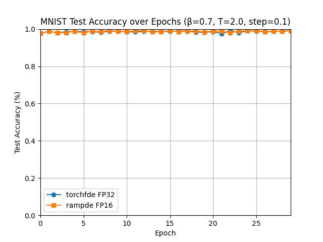
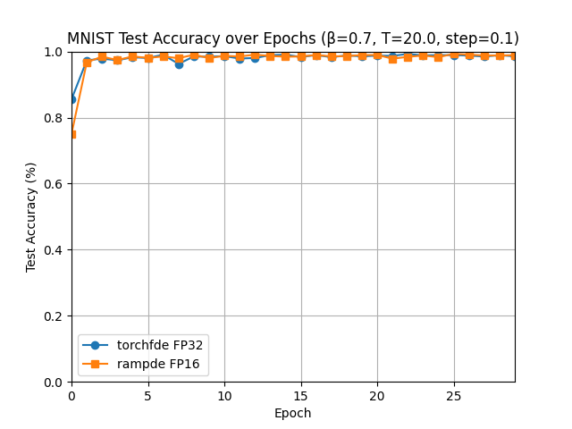
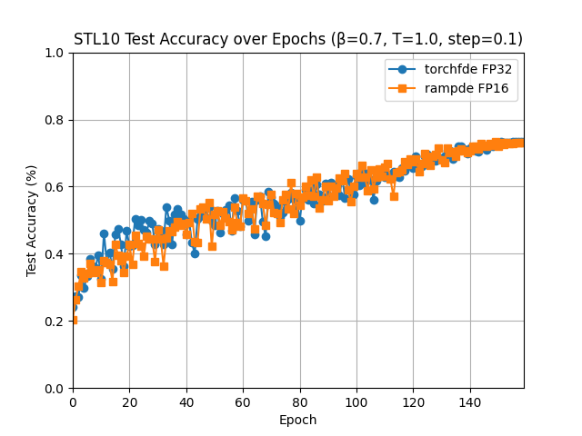
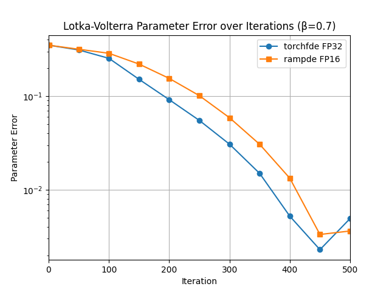

# June 8 Mixed Precision Neural FDE Tests

## MNIST
Here we ran two tests: one with $T=2$ (21 layers) as a smoke test, and another with $T=20$ (201 layers) which requires much more memory. 

Experiment Parameters:
- Network Architecture:
    - Same as torchfde/Neural FDE paper 

- FDE_Block:
    - Beta: 0.7
    - T: 2, 20
    - step_size: 0.1
    - $f$ in $D^\beta z = f$: Convolution Module

- Training Arguments:
    - Epochs: 30 
    - Batch Size: 128
    - Initial LR: 0.1, decay at specified boundary epochs 
    - Momentum: 0.9
    - Weight decay: 5e-4
    - GPU: NVIDIA H200 (Palmetto)


First, for $T=2$, we have memory savings of 44.5% with similar performance.
```text
======================================================================
  Neural FDE MNIST: torchfde FP32 vs rampde FP16
======================================================================
  β=0.7  T=2.0  h=0.1  N=21  params=208,266  epochs=30

  Metric                  torchfde FP32   rampde FP16           Δ
  --------------------------------------------------------------
  Best test acc                  0.9920        0.9919      -0.00
  Final test acc                 0.9920        0.9905      -0.00
  Avg peak mem (MB)               327.5         181.9    -145.66
  Max peak mem (MB)               327.5         181.9    -145.66

  Memory saving: 44.5%  (rampde uses less)
======================================================================
```




Now, for a deeper network with $T=20$, we have memory savings of 81.4% again with very similar performance results. 
```text
======================================================================
  Neural FDE MNIST: torchfde FP32 vs rampde FP16
======================================================================
  β=0.7  T=20.0  h=0.1  N=201  params=208,266  epochs=30

  Metric                  torchfde FP32   rampde FP16           Δ
  --------------------------------------------------------------
  Best test acc                  0.9927        0.9929      +0.00
  Final test acc                 0.9854        0.9889      +0.00
  Avg peak mem (MB)              2050.7         381.1   -1669.60
  Max peak mem (MB)              2050.7         381.1   -1669.60

  Memory saving: 81.4%  (rampde uses less)
======================================================================
```




## STL10
For STL10, we follow a similar framework as presented in the rampde paper (mixed precision NODE paper). 

Experiment Parameters:
- Network Architecture:
    - 3-stage FDE network matching rampde paper STL-10 architecture:
        128×128×ch  →  FDE1  →  64×64×2ch  →  FDE2  →  32×32×4ch  →  FDE3  →  FC

- FDE_Block:
    - Beta: 0.7
    - T: 1.0
    - step_size: 0.1
    - $f$ in $D^\beta z = f$ 2-layer conv with InstanceNorm

- Training Arguments:
    - Epochs: 160 
    - Batch Size: 16
    - Initial LR: 0.05
    - Momentum: 0.9
    - Weight Decay: 5e-4
    - GPU: NVIDIA H200 (Palmetto)

With this configuration, we have 79.8% memory savings with similar performance. 
```text
======================================================================
  Neural FDE STL10: torchfde FP32 vs rampde FP16
======================================================================
  β=0.7  T=1.0  h=0.1  N=11  params=1,606,538  epochs=160

  Metric                  torchfde FP32   rampde FP16           Δ
  --------------------------------------------------------------
  Best test acc                  0.7345        0.7329      -0.00
  Final test acc                 0.7344        0.7299      -0.00
  Avg peak mem (MB)              9201.9        1854.5   -7347.39
  Max peak mem (MB)              9201.9        1854.5   -7347.39

  Memory saving: 79.8%  (rampde uses less)
======================================================================
```



## Lotka-Volterra Parameter Estimation

Fractional Lotka-Volterra parameter estimation: torchfde FP32 vs rampde FP16.

Replicates Section 5.1 of "Efficient Training of Neural FDE via Adjoint Backpropagation" (Kang et al., AAAI 2025, arXiv:2503.16666).

True system:  
```math
\begin{aligned}
    D^\beta x &= x(a - cy) \\
    D^\beta y &= -y(b - dx)
\end{aligned}
```
True params:  $[a, b, c, d] = [1.0, 0.5, 1.0, 0.3]$
$\beta = 0.7$ (we use 0.7 instead of their unspecified value).

Task: Given noisy trajectory data, learn $[a, b, c, d]$ by fitting the FDE.
Both solvers see identical data and optimizer.

Experiment Parameters:
- Network Architecture:
    - 3-stage FDE network matching rampde paper STL-10 architecture:
        128×128×ch  →  FDE1  →  64×64×2ch  →  FDE2  →  32×32×4ch  →  FDE3  →  FC

- FDE_Block:
    - Beta: 0.7
    - T: 5.0
    - step_size: 0.1
    - $f$ in $D^\beta z = f$: 2-layer conv with InstanceNorm

- Training Arguments:
    - Iterations: 500 
    - Training Trajectories: 50
    - Initial LR: 0.01
    - Noise SD: 0.05
    - GPU: NVIDIA H200 (Palmetto)
    - Initial Parameters: $[a,b,c,d] = [0.49, 0.24, 0.52, 0.15]$


With this configuration, we have an 80.5% savings in memory with similar best/final parameter error (MSE). 
```text
======================================================================
  Neural FDE Lotka-Volterra: torchfde FP32 vs rampde FP16
======================================================================
  β=0.7  T=5.0  T=5.0 iterations=500

  Metric                  torchfde FP32   rampde FP16           Δ
  --------------------------------------------------------------
  Best parameter error           0.0023        0.0033  +     0.00
  Final parameter error          0.0049        0.0036      -0.00
  Avg peak mem (MB)                 0.2           0.0      -0.15
  Max peak mem (MB)                 0.2           0.0      -0.15

  Memory saving: 80.5%  (rampde uses less)
======================================================================
```


